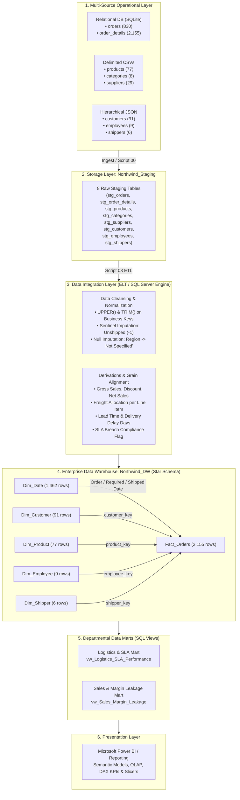

# Northwind Enterprise Data Warehouse (Northwind_DW)
## IT3101 — Data Warehousing and Business Intelligence | Project ID: 2026-DS-86

This repository contains all production SQL scripts, dimensional schema definitions, ETL transformation pipelines, data marts, and validation queries implemented in **Microsoft SQL Server (SSMS)** for the Northwind Traders analytical platform. All scripts have been empirically tested and strictly verified to match the screenshots, row counts, and analytical results in the submission report (**`DWBI Final Reoprt.pdf`**).

---

## 🏗️ End-to-End Solution Architecture

---

## 📂 Repository File Structure & Execution Order

All SQL scripts are self-contained and numbered sequentially for execution in **SQL Server Management Studio (SSMS)**:

| Script Name | Target Database | Description & Purpose | Report Page Reference |
| :--- | :--- | :--- | :--- |
| **`00_create_and_load_staging.sql`** | `master` &rarr; `Northwind_Staging` | Creates `Northwind_Staging` and populates all 8 tables with complete data from SQLite, CSVs, and JSON. | **Page 6** (Task 3) & **Page 13** (Task 5.1) |
| **`01_staging_verification.sql`** | `Northwind_Staging` | Validates multi-source ingestion row counts across all 8 staging tables without data loss. | **Page 6** (Table 3.1) & **Page 13** (Table 5.1) |
| **`02_create_dw_schema.sql`** | `master` &rarr; `Northwind_DW` | DDL script that generates the Kimball Star Schema, surrogate keys, and foreign keys. | **Pages 8–12** (Task 4) |
| **`03_etl_pipeline_load.sql`** | `Northwind_DW` | Sequentially cleans, transforms, derives measures, and loads staging data into dimension and fact tables. | **Pages 13–16** (Task 5) |
| **`04_etl_validation_tests.sql`** | `Northwind_DW` | Contains all 6 audit queries proving data quality, conversions, derived measures, and referential integrity. | **Pages 14–17** (Task 5.2 & 5.3) |
| **`05_create_data_marts.sql`** | `Northwind_DW` | Creates the two departmental views (`vw_Logistics_SLA_Performance`, `vw_Sales_Margin_Leakage`) and audit queries. | **Pages 17–19** (Task 6) |
| **`ETL_PROCESS.md`** | N/A | Comprehensive technical documentation of the entire Extract, Transform, and Load lifecycle. | **Tasks 2, 3, 5, 6** |

---

## 🗺️ Mapping SQL Queries to Final Report Screenshots

| Test # | SQL Script | Description | Screenshot Location in Report | Verification Outcome |
| :---: | :--- | :--- | :--- | :--- |
| **—** | `01_staging_verification.sql` | Staging Ingestion Record Counts | **Page 6** (Table 3.1) & **Page 13** (Section 5.1) | 830 orders, 2,155 details, 77 products, 8 categories, 29 suppliers, 91 customers, 9 employees, 6 shippers |
| **—** | `02_create_dw_schema.sql` | Star Schema DDL & Schema Diagram | **Page 8** (Diagram) & **Pages 9–11** (Tables) | Central `Fact_Orders` (grain: 1 order line item) with 5 conformed dimension tables and role-playing date keys |
| **Test 1** | `04_etl_validation_tests.sql` | Missing Value Imputation | **Page 14** (Top Results Grid) | 73 unshipped lines assigned `shipped_date_key = -1`, `is_shipped = 0`; 60 customer regions imputed with `'Not Specified'` |
| **Test 2** | `04_etl_validation_tests.sql` | String Sanitization & Whitespace Audit | **Page 14** (Bottom Results Grid) | Returns `0` untrimmed customer IDs, `0` untrimmed company names, and `0` non-uppercase natural keys |
| **Test 3** | `04_etl_validation_tests.sql` | Data Type Conversions (sys.columns) | **Page 15** (Top Results Grid) | Integer date keys (`int`), monetary/sales measures formatted as fixed-point decimals (`decimal(12,2)`) |
| **Test 4** | `04_etl_validation_tests.sql` | Derived Measures Trace | **Page 15** (Bottom Results Grid) & **Page 16** | Order 10264: Gross = $192.50, Discount = $28.88, Net = $163.63, Lead Time = 30d, Delay = 2d, SLA Breached = 1 |
| **Test 5** | `04_etl_validation_tests.sql` | DW Row Count Preservation (Zero Loss) | **Page 16** (Top Results Grid) | `Dim_Date`: 1,462 \| `Dim_Customer`: 91 \| `Dim_Product`: 77 \| `Dim_Employee`: 9 \| `Dim_Shipper`: 6 \| `Fact_Orders`: 2,155 |
| **Test 6** | `04_etl_validation_tests.sql` | Referential Integrity (Zero Orphan Keys) | **Page 17** (Top Results Grid) | All 5 orphan count columns return `0`, proving 100% referential integrity |
| **Mart 1** | `05_create_data_marts.sql` | Logistics & SLA Performance Mart | **Page 17** (Bottom) & **Page 18** (Bottom) | Isolates delivery delays and SLA breach orders (e.g., 10264, 10271, 10280) with freight allocation |
| **Mart 2** | `05_create_data_marts.sql` | Sales Margin Leakage Mart | **Page 18** (Top) & **Page 19** (Bottom) | Identifies highest discounts granted by sales reps (Robert King, Steven Buchanan, Andrew Fuller) |

---

## 🚀 Step-by-Step Execution Guide in SSMS

1. Open **Microsoft SQL Server Management Studio (SSMS)** and connect to your SQL Server instance (Windows Authentication).
2. Open and run **`00_create_and_load_staging.sql`** to create the `Northwind_Staging` database and populate all raw staging tables.
3. Run **`01_staging_verification.sql`** to confirm all 8 staging tables received 100% of operational records.
4. Run **`02_create_dw_schema.sql`** to create the clean `Northwind_DW` database and Star Schema structures.
5. Run **`03_etl_pipeline_load.sql`** to execute the complete transformation and dimensional loading sequence.
6. Run **`04_etl_validation_tests.sql`** to run the 6 verification queries; verify that the output rows match the report screenshots.
7. Run **`05_create_data_marts.sql`** to create the analytical views and run the sample queries for Logistics and Sales reporting.
